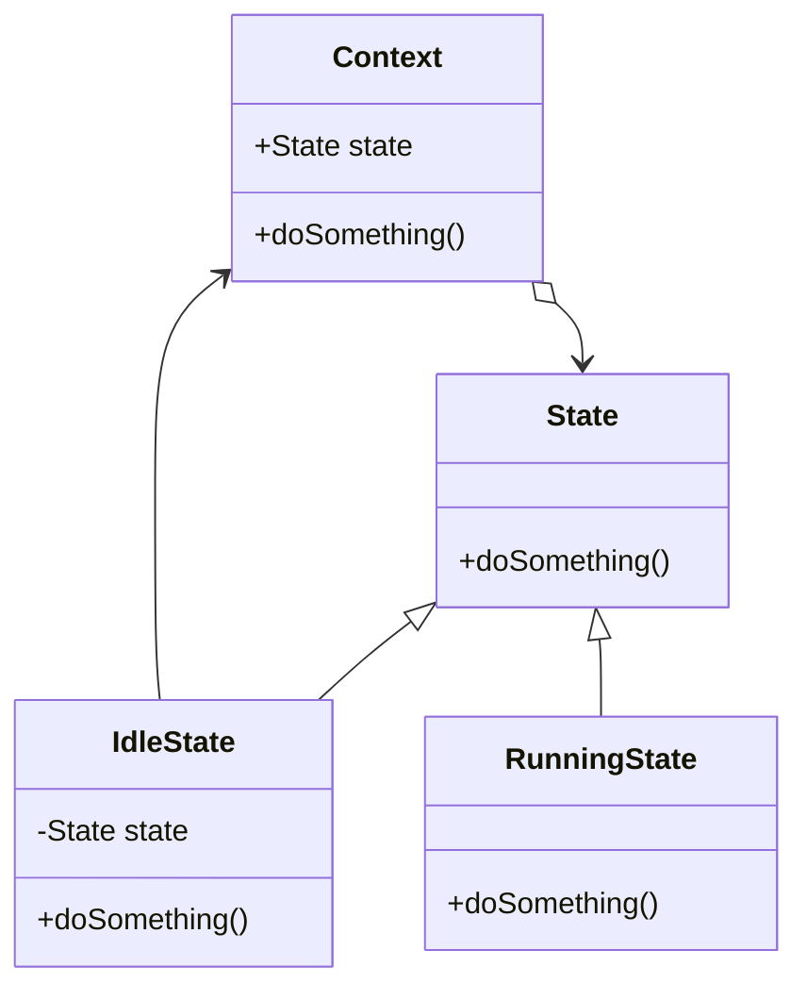

记录对部分设计模式的本质的理解，尤其是与课程教授内容不同的独到理解🧐。

## 三种分类

- 创建型：创建对象。**创建逻辑和业务逻辑的解耦。**
本来创建一个对象逻辑可能有 114 行，但是业务逻辑对着过程不感兴趣。所以将其封装为一个 `createXXX()` 接口。其实和行为型在本质上是一样的，只是强调创建对象的接口目标。
- 结构型：处理类和对象的组合。**接口和实现的解耦**。
对于一些特殊的非功能需求（或者严格来说，一些与具体功能无关的需求。也有可能是功能需求，比如给一个类增加新职责，但是结构型设计模式不关心增加的是什么需求），结构型提供一套接口和类、对象的组合方式。能够满足开闭原则等设计原则。
- 行为型：处理职责分配。**行为和控制流的解耦**。
行为型如前所说，控制流对具体行为不关心，所以将具体行为封装为一个 `doXXX()` 接口。

## 策略模式

### 为什么策略模式需要一个上下文类?

正如其名，上下文类扮演的是一个**有状态**的具体策略容器，职责是持有某种策略并接受状态转移。以便于在客户端的不同部位保持某一上下文。

顺便：
- 客户端负责策略选择、上下文类创建的职责
- 具体策略类负责策略的执行，将具体策略封装与解耦。所以是个行为型模式

> 其实其他模式的上下文类也起到了类似的作用，请举一反三

## 工厂模式

### 工厂方法和简单工厂

课上讲的比较复杂，比如工厂方法是将具体产品的创建推迟到具体工厂等等。但这其实造成了误解，如果仅仅是推迟创建，表面上看那工厂方法并没解决简单工厂的弊端——新增产品需要修改工厂类，违反了开闭原则。但是现实是工厂方法新增产品确实不需要修改工厂类。

根本原因是：
- 简单工厂中，客户端**创建什么类型的产品的决策**是通过**参数**传递的。客户端传递一个如字符串的参数，工厂类中写个switch来判断创建什么产品。这样自然会违反开闭原则
- 工厂方法中，抽象工厂是个接口或者抽象类。客户端创建产品的决策树通过**创建对应的具体工厂**来决定的。这时创建产品的判断逻辑是由多态或者 RTTI 来实现的。

前者的选择逻辑**依赖于具体代码**（switch或者ifelse），后者**依赖于一系列具体工厂类**。所以后者是更加符合开闭原则的选择。

所以，工厂方法的职责分配本质是：
- 客户端：选择产品类的**别名**（比如字符串，或者工厂方法的工厂类）
- 工厂：建立别名到具体产品的**映射**，以及负责产品的初始化
- 产品：哈哈我是工厂模式里没有职责的摸鱼产品😆

### 抽象工厂

就是在工厂类封装多种产品。记住英文叫 Kit 模式。

## 建造者模式

- 客户端：选择复杂产品的种类，指定产品参数
- 指挥者：维护建造者上下文（状态），零件制造控制流
- 建造者：每个零件具体怎么造

## 原型模式

无他，唯 `Java.Object.clone()` 尔

## 状态模式

行为封装在状态里面。

不对吧，这和策略模式没区别阿？？？

### 与策略模式的区别

状态类可以持有上下文类的引用，并在封装的行为中改变上下文类的状态为其他状态。（所以类图里状态类应该有一个指向上下文类的关联或组合）

而策略模式中，各策略是完全独立的。策略也不知道上下文类的存在。

举例：从`IdleState` 到 `RunningState` 的转移



```python
IdleState::doSomething():
	this.state = runningState
```

## 命令模式

### 如何理解“命令模式解耦了发送方和接收方”

**客户端**预制了一些命令，命令里面**封装了接收方的引用**了。发送方（Invoker）只需要管调用就行了，而且只需**面向抽象命令接口**来执行。

### 宏命令 / 组合命令

一个特殊的具体命令类，包含了一堆其他的命令。执行就是把其持有的其他命令全部执行一遍。

宏命令还能包含其他命令。这样似乎可以组成一个树形的结构，变成了一个组合模式🤯。

## 观察者模式

### 类图理解

模式分为接口层和实现层。

接口层包含了 被观察对象 对 观察者 的通知逻辑。因为这个通知 notify 的逻辑是不变的，所以直接写死在接口（抽象类）中。

实现层包含了 观察者 对 被观察对象 的观察逻辑（拿状态）。因为这个观察的逻辑是可变的，所以封装在实现层中。

### 缺点以及替代方案

这是基于事件通知的观察者模式。缺点是频繁更新会多次触发，效率低。

替代方案是基于轮询的观察者模式。主动权从被观察对象转移到了观察者。缺点是实时性低，存在状态不一致的时机。

## 中介者模式

一个统一的中介。没啥好介绍的，需要具体例子具体分析。

## 模板方法模式

控制流中的某些部分可能有多种版本。将其抽离出来。

这些抽出来的部分有三个分类：
- 部分逻辑(可选步骤，默认实现，也可重写)以具体方法以及具体构造函数实现问题：通过子类重写默认步骤可能违反里氏替换原则
- 剩余逻辑(抽象步骤，必须由子类实现)声明抽象方法来让子类实现。
- 钩子(hook)：钩子是内容为空的可选步骤。即使不重写钩子，模板方法也能工作。通常放置在算法重要步骤的前后，为子类提供额外的算法扩展点

说实话，有点强行分类的意味。钩子和剩余逻辑的界限不是很明确，每个人的理解不一样的。比如 init()，你可以说是初始化的剩余逻辑，也可以说是生命周期的钩子。

部分逻辑同理。

### 开闭模式的体现

增加新版本的逻辑，通过子类就能拓展父类行为。
无法修改现有的逻辑，因为现有的逻辑是封装在父类的。

### 好莱坞原则

子类不需要调用父类，而通过父类来调用子类，将某些步骤的实现写在子类中，由父类来控制整个过程。

*不要给我们打电话，我们会给你打电话*

## 适配器模式

两种实现：类适配器和对象适配器

前者基于多继承，后者基于组合。

### 两种实现区别与使用场景

类适配器就是一坨：强耦合、违反合成复用、有时第三方库无法继承、需要多继承、扩展性差。

唯一的优点是某些情况下写起来方便、容易理解。

能用对象适配器就用对象适配器吧。

### 双向适配器

我不明白，为啥不用两个适配器？揉在一起乱麻了。

## 组合模式

无他，唯文件夹、文件尔。

## 桥接模式

讲得很抽象。其实就是对于有多个变化维度的对象：
- 指定一个维度为主变化维度，通过继承/实现来获得变化
- 其他的变化维度通过组合来获得变化

至于如何选取主变化维度，不同的业务视角会给出不同的答案。所以不用太过纠结，言之有理即可。

## 装饰模式

### 抽象装饰类的作用

为啥要用这个抽象装饰类？直接继承要装饰的类不就好了，这样也不违反开闭原则。而且不管对于使用方还是装饰类的创建方，都是必须要知道自己在操作哪个具体装饰类的。

并非，抽象装饰类主要目的是递归组合。装饰是可以递归组合的：
```cpp
Component *c = new BorderDecorator(
                  new UnderlineDecorator(
                    new BoldDecorator(
                      new Text("Hello")
                    )
                  )
                );
```

只有一个具体装饰类就可以省略抽象装饰类。

## 外观模式

有一个外观/门户类 Facade。

- 体现迪米特法则
- 违反开闭原则，可能需要添加抽象外观类。

## 享元模式

共享对象池。记住英文为 flyweight，即轻量。

## 代理模式

### 作用与特点

- 至少与被代理的对象有相同的接口
- 对已有接口增加额外操作，比如权限控制、错误处理
- 增加新的接口

### 类型

- 远程代理：与被代理的对象有相同的接口，代理和代理对象物理上分开
- 虚拟代理：重型对象的轻量表示。在必要的时候才加载重型对象
- CoW 代理：Copy-on-Write。与虚拟代理类似
- 保护代理：增加访问控制
- 缓冲代理：提供临时存储空间
- 防火墙代理：白名单、黑名单式的访问控制
- 智能引用代理：C++ 智能指针，有引用计数。甚至可以做调用日志这种